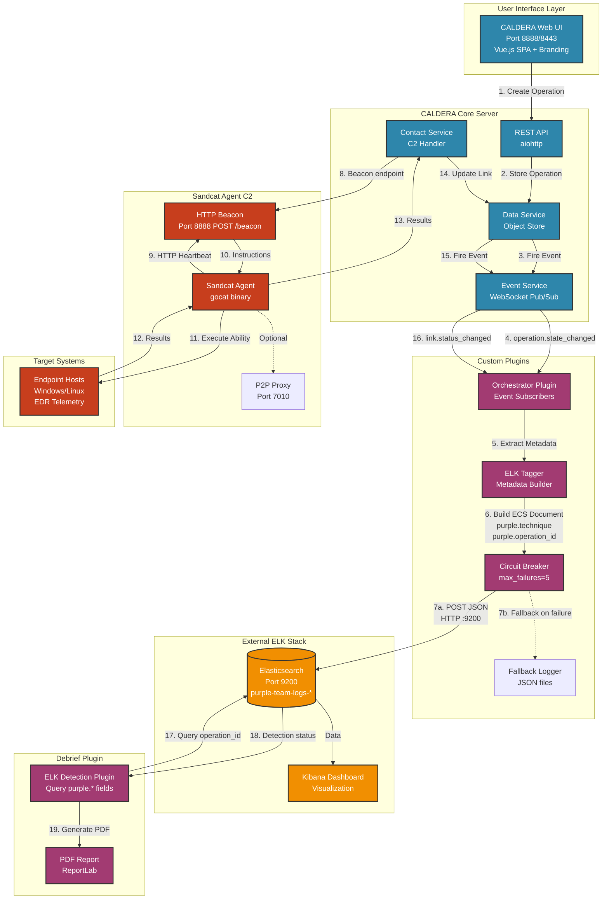

# Purple Team Automation - Internship Project

**Internship Portoflio Project** 
*Tony To | Triskele Labs Internship (January-February 2026)*

[]() []()

---

## ⚠️ Project Disclaimer

**This is an internship learning project, NOT production software.**

- **Purpose**: Demonstrate software development and detection engineering skills
- **Context**: Educational exercise completed during Triskele Labs internship
- **Status**: Portfolio proof-of-concept showcasing technical capabilities
- **NOT**: Production-ready, officially supported, or intended for operational deployment

**Author**: Tony To (Detection Engineering & Automation Intern)  
**Organisation**: Triskele Labs (Internship Programme)  
**Timeline**: January-February 2026

See [INTERNSHIP_DISCLAIMER.md](INTERNSHIP_DISCLAIMER.md) for complete legal information.

---

## Project Overview

During my internship at Triskele Labs, I developed custom Caldera plugins to demonstrate software development capabilities and detection engineering concepts learned throughout the programme.

### Software Development Skills Demonstrated

**Backend Development**:
- Python async/await patterns for concurrent operations
- Event-driven architecture with pub/sub messaging
- RESTful API design and implementation
- Database integration (object store, fact store)
- Error handling and graceful degradation patterns

**Frontend Integration**:
- Vue.js 3 component development
- Single Page Application (SPA) architecture
- REST API consumption and state management
- Responsive UI design

**DevOps & Infrastructure**:
- Docker containerisation and orchestration
- Environment configuration management
- CI/CD pipeline integration
- System monitoring and logging

### Detection Engineering Concepts Learned

**SIEM Integration**:
- Elasticsearch Query DSL for threat hunting
- Real-time event correlation and tagging
- Detection coverage gap analysis
- Alert enrichment and contextualisation

**Purple Team Methodologies**:
- MITRE ATT&CK framework mapping
- Adversary emulation planning and execution
- Detection validation through controlled testing
- Coverage analysis and reporting

**Security Automation**:
- Automated detection tagging in SIEM
- Detection coverage reporting
- Event-driven security workflows
- Sanitisation and input validation

### Custom Plugins Built

1. **Orchestrator Plugin**: Event-driven SIEM tagging system
   - Automatic Elasticsearch integration
   - Operation lifecycle tracking
   - Circuit breaker patterns for resilience
   - Fallback logging mechanisms

2. **Reporting Plugin**: Detection coverage analysis
   - PDF generation with ReportLab
   - ELK detection correlation
   - Visual coverage gap identification
   - Multi-operation aggregation

3. **Branding Plugin**: UI customisation framework
   - Theme management system
   - Dynamic branding injection
   - Asset management

4. **Debrief-ELK Plugin**: SIEM detection validation
   - Per-technique detection status
   - Color-coded coverage visualisation
   - Graceful degradation when SIEM unavailable

---

## Quick Start (Development Environment)

```bash
# Start the full environment (ELK + Caldera)
./scripts/tl-startup.sh

# Check system status
./scripts/tl-status.sh

# Graceful shutdown
./scripts/tl-shutdown.sh
```

Access the web interface at `http://localhost:8888` after startup.

## Documentation

**Note**: All documentation describes educational work developed during an internship, not production systems.

### Getting Started

For portfolio reviewers and technical interviewers:

- [Installation Guide](docs/getting-started/installation.md) - System requirements and setup
- [Quick Start Guide](docs/getting-started/quick-start.md) - Get operational in 10 minutes
- [Configuration Reference](docs/getting-started/configuration.md) - Environment and system configuration

### Usabout the features I built

Learn how to use the platform effectively:

- [Platform Overview](docs/user-guide/overview.md) - Architecture and core concepts
- [Agent Management](docs/user-guide/agents.md) - Deploy and manage agents across environments
- [Running Operations](docs/user-guide/operations.md) - Execute adversary emulation campaigns
- [Reporting and Analysis](docs/user-guide/reporting.md) - Generate and interpret results

### Technical Reference

For developers and system integrators:

- [System Architecture](docs/architecture/system-overview.md) - Component architecture and data flow
- [API Reference](docs/technical/api-reference.md) - REST API endpoints and authentication
- [Datvelopment Environment Setup

Setting up the development/learning environment:

- [Local Setup](docs/deployment/local-deployment.md) - Standalone development server
- [Docker Setup](docs/deployment/docker-deployment.md) - Containerised development
- [ELK Integration](docs/deployment/elk-integration.md) - SIEM integration for learning
- [Troubleshooting](docs/deployment/troubleshooting.md) - Common setup deployment
- [ELK Integration](docs/deployment/elk-integration.md) - SIEM correlation setup
- [Troubleshooting](docs/deployment/troubleshooting.md) - Common deployment issues

### Development

Contributing to the project:

- [Plugin Development](docs/development/plugin-development.md) - Create custom plugins
- [Contributing Guidelines](docs/CONTRIBUTING.md) - How to contribute code
- [Testing Guide](docs/development/testing.md) - Test suite and quality standards

### Reference

Quick access documentation:

- [FAQ](docs/reference/faq.md) - Frequently asked questions
## Key Technical Achievements

### Software Development

**Architecture & Design Patterns**:
- Implemented event-driven architecture with pub/sub pattern for real-time SIEM integration
- Developed circuit breaker pattern for resilient external service integration
- Built plugin-based modular architecture with clear separation of concerns
- Applied dependency injection for testability and maintainability

**Python Development**:
- Async/await patterns for concurrent API calls and database operations
- Decorator patterns for authentication and authorisation
- Context managers for resource lifecycle management
- Type hints and comprehensive error handling

**API Development**:
- RESTful endpoint design following OpenAPI specifications
- Request validation and sanitisation
- API versioning and backwards compatibility

### Detection Engineering

**SIEM Correlation**:
- Elasticsearch integration for real-time event correlation
- Query optimisation for large-scale log analysis
- Detection rule development and validation
- Alert enrichment with MITRE ATT&CK context

**Purple Team Operations**:
- Adversary emulation workflow automation
- MITRE ATT&CK technique mapping and execution
- Detection coverage gap analysis methodology
- Purple team reporting and metric visualisation

**Security Automation**:
- Automated detection validation framework
- Operation tagging for SIEM alert filtering
- Detection coverage reporting pipeline
- Input validation and sanitisation practices

### DevOps & Infrastructure

**Containerisation**:
- Service dependency management
- Volume management for data persistence
- Network isolation and port mapping

**Configuration Management**:
- YAML-based configuration system
- Environment variable injection
- Secrets management patterns
- Multi-environment configuration support

**Monitoring & Logging**:
- Structured logging with Python logging module
- Log aggregation and analysis
- Error tracking and debugging workflows
- Performance monitoring and optimisation

---

## Skills Demonstrated

This internship project showcases competencies in:

**Software Development**:
- Backend development (Python, async/await, REST APIs)
- Frontend integration (Vue.js, SPA architecture)
- Database design (object stores, Elasticsearch)
- Testing (unit tests, integration tests, fixtures)
- Version control (Git, branching strategies)
- Documentation (technical writing, API docs)

**Detection Engineering**:
- SIEM integration (Elasticsearch/ELK Stack)
- MITRE ATT&CK framework application
- Purple team methodologies
- Detection validation and coverage analysis
- Security event correlation
- Threat intelligence integration

**Security & DevOps**:
- Secure coding practices
- Input validation and sanitisation
- Docker containerisation
- CI/CD pipeline integration
- Infrastructure as code
- System architecture design

## System Requirements

- **Python** - 3.9 or higher
- **Elasticsearch** - 8.11.0 or higher
- **Memory** - 4GB RAM minimum, 8GB recommended
- **Operating System** - Linux, macOS, Windows with WSL

## Architecture

The platform employs a modular architecture with seven core plugins integrated with an external ELK Stack for detection validation.

### System Architecture Diagram



### Network Ports and Services

| Port | Protocol | Service | Purpose | Component |
|------|----------|---------|---------|-----------|
| **8888** | HTTP | CALDERA Web UI | Primary web interface and agent beacons | Core Server |
| **8443** | HTTPS | CALDERA SSL | Encrypted web access | Core Server |
| **7010** | TCP | Sandcat P2P | Agent-to-agent proxy communication | Sandcat Plugin |
| **7011** | UDP | DNS Tunneling | Covert C2 channel (optional) | Contact Service |
| **7012** | TCP | Gist C2 | GitHub Gist-based C2 (optional) | Contact Service |
| **8853** | TCP | WebSocket | Agent communication tunneling | Contact Service |
| **8022** | TCP | FTP | File upload/download C2 channel | Contact Service |
| **2222** | TCP | Custom TCP | Generic TCP beacon handler | Contact Service |
| **9200** | HTTP | Elasticsearch | SIEM data ingestion and queries | External ELK Stack |

> **Note**: Elasticsearch/ELK Stack is deployed separately on the local machine (not included in this repository). See [ELK Integration Guide](docs/deployment/elk-integration.md) for setup instructions.

### Metadata Injection Flow

The orchestrator plugin automatically tags purple team operations in Elasticsearch with MITRE ATT&CK metadata:

```
┌─────────────────────────────────────────────────────────────────┐
│  1. Operation Created                                           │
│     User → REST API → data_svc.create_operation()              │
└────────────────────────┬────────────────────────────────────────┘
                         │
                         ▼
┌─────────────────────────────────────────────────────────────────┐
│  2. Event Service Fires                                         │
│     event_svc.fire_event(exchange='operation',                  │
│                          queue='state_changed')                 │
└────────────────────────┬────────────────────────────────────────┘
                         │
                         ▼
┌─────────────────────────────────────────────────────────────────┐
│  3. Orchestrator Listens                                        │
│     orchestrator_svc.on_operation_state_changed()               │
│     - Extract operation metadata                                │
│     - Build ECS-compatible document                             │
└────────────────────────┬────────────────────────────────────────┘
                         │
                         ▼
┌─────────────────────────────────────────────────────────────────┐
│  4. Sanitize and Validate                                       │
│     elk_tagger._sanitize_metadata()                             │
│     - Validate MITRE ATT&CK IDs (T1234, T1234.001)             │
│     - Sanitize operation names (remove special chars)           │
│     - Limit field lengths                                       │
└────────────────────────┬────────────────────────────────────────┘
                         │
                         ▼
┌─────────────────────────────────────────────────────────────────┐
│  5. Tag in Elasticsearch                                        │
│     POST http://localhost:9200/purple-team-logs-*/_doc          │
│     {                                                           │
│       "@timestamp": "2026-02-10T12:34:56Z",                     │
│       "purple": {                                               │
│         "technique": "T1078",                                   │
│         "tactic": "TA0001",                                     │
│         "operation_id": "a1b2c3d4-...",                         │
│         "detection_status": "pending"                           │
│       },                                                        │
│       "tags": ["purple_team", "purple_T1078"]                  │
│     }                                                           │
└────────────────────────┬────────────────────────────────────────┘
                         │
                         ▼
┌─────────────────────────────────────────────────────────────────┐
│  6. Circuit Breaker Check                                       │
│     if ELK unavailable:                                         │
│       - Increment failure count                                 │
│       - Open circuit after 5 failures                           │
│       - Fallback to JSON file logging                           │
│     else:                                                       │
│       - Reset failure count                                     │
│       - Continue normal operation                               │
└─────────────────────────────────────────────────────────────────┘
```

### Core Plugins

- **Magma** - Vue.js 3 frontend interface
- **Sandcat** - Cross-platform agent (GoLang) with HTTP, P2P, DNS, and FTP C2 channels
- **Stockpile** - Adversary profiles and abilities library (MITRE ATT&CK mapped)
- **Atomic** - MITRE Atomic Red Team integration
- **Orchestrator** - Event-driven SIEM tagging with circuit breaker and fallback logging
- **Branding** - Custom theming and visual identity (middleware injection)
- **Reporting** - PDF and HTML report generation with detection correlation

For detailed architecture documentation, see [System Architecture](docs/architecture/system-overview.md) or the [Architectural Review](internship-blog/verified-content/architectural-review.md).

## Repository Structure

```
├── app/                        # Main application source code
│   ├── api/                    # REST API handlers
│   ├── contacts/               # Agent communication protocols
│   ├── objects/                # Core data models
│   ├── planners/               # Operation planning algorithms
│   └── service/                # Business logic services
├── config/                     # Configuration files
│   ├── conf/                   # YAML configuration
│   ├── docker-compose.yml      # Container orchestration
│   └── Dockerfile              # Container image definition
├── data/                       # Runtime data storage
│   ├── abilities/              # Technique definitions
│   ├── adversaries/            # Adversary profiles
│   ├── results/                # Operation results
│   └── sources/                # Fact sources
├── docs/                       # Documentation
│   ├── architecture/           # Architecture specifications
│   ├── deployment/             # Deployment guides
│   ├── development/            # Developer documentation
│   ├── getting-started/        # Beginner guides
│   ├── guides/                 # Operational guides
│   ├── plugins/                # Plugin documentation
│   ├── reference/              # Quick reference materials
│   ├── technical/              # Technical specifications
│   └── user-guide/             # End-user documentation
├── plugins/                    # Caldera plugins
│   ├── atomic/                 # Atomic Red Team integration
│   ├── branding/               # UI customisation
│   ├── debrief/                # Operation analytics
│   ├── magma/                  # Frontend UI
│   ├── orchestrator/           # Workflow automation
│   ├── reporting/              # Report generation
│   ├── sandcat/                # Agent implementation
│   └── stockpile/              # Ability repository
├── scripts/                    # Automation scripts
├── static/                     # Web assets
├── templates/                  # HTML templates
├── tests/                      # Test suite
├── require Notice

This is educational software developed in a controlled lab environment. It is NOT intended for use in real security operations.

For questions about this internship project, see [INTERNSHIP_DISCLAIMER.md](INTERNSHIP_DISCLAIMER.md).

## License

Educational/Portfolio License - See [LICENSE](LICENSE) for details.

**Summary**: This code is shared for portfolio review and educational purposes only. Not licensed for commercial use, production deployment, or public distribution.

---

## Technical Deep Dive

### 1. Orchestrator Plugin - SIEM Integration

**Problem Solved**: Manual SIEM alert triaging was taking time per purple team exercise, requiring analyst to manually identify and close alerts generated by controlled testing.

**Solution Architecture**:
- Event-driven architecture listening to Caldera operation lifecycle
- Automatic Elasticsearch document enrichment with operation metadata
- Circuit breaker pattern preventing cascade failures
- Fallback logging when SIEM unavailable

**Technologies**: Python async/await, Elasticsearch Python client, aiohttp, event-driven pub/sub

**Key Learnings**:
- Asynchronous error handling and retry logic
- Service resilience patterns (circuit breaker, fallback)
- Real-time event correlation in SIEM
- API integration with external services

### 2. Reporting Plugin - Detection Coverage Analysis

**Problem Solved**: No automated way to visualise which MITRE ATT&CK techniques were detected vs. evaded during purple team exercises.

**Solution Architecture**:
- PDF generation pipeline with ReportLab
- Elasticsearch query aggregation for detection correlation
- Color-coded coverage matrices
- Multi-operation comparison capabilities

**Technologies**: ReportLab (PDF generation), Elasticsearch Query DSL, Python data analysis, Jinja2 templating

**Key Learnings**:
- Document generation and layout design
- Complex Elasticsearch aggregations
- Data visualisation for security metrics
- Report automation pipeline design

### 3. Debrief-ELK Plugin - Detection Validation

**Problem Solved**: Purple team reports didn't show which techniques were actually detected by the SIEM.

**Solution Architecture**:
- SIEM detection correlation engine
- Per-technique detection status tracking
- Graceful degradation when ELK unavailable
- Integration with existing Caldera debrief system

**Technologies**: Elasticsearch integration, Python data structures, plugin hooks

**Key Learnings**:
- Detection validation methodologies
- MITRE ATT&CK technique correlation
- Plugin architecture and hooks
- Defensive coding for service availability

---

## What I Learned

### Software Development Concepts

**Architecture Patterns**:
- Event-driven architecture for real-time systems
- Plugin architecture for extensibility
- Microservices communication patterns
- Service-oriented architecture (SOA)

**Python Engineering**:
- Asynchronous programming (async/await, event loops)
- Decorator patterns for cross-cutting concerns
- Context managers for resource management
- Type hints for code quality
- Testing strategies (unit, integration, mocking)

**API & Integration**:
- RESTful API design principles
- API authentication and authorisation
- External service integration patterns
- Error handling and retry logic

### Detection Engineering Principles

**SIEM Operations**:
- Elasticsearch Query for threat hunting
- Log correlation and enrichment techniques
- Detection rule development workflow
- SIEM performance optimisation

**Purple Team Methodology**:
- Adversary emulation planning
- MITRE ATT&CK framework application
- Detection coverage measurement
- Purple team metrics and reporting

**Security Automation**:
- Automated detection validation
- Operation lifecycle tracking
- Coverage gap identification
- Detection engineering pipeline automation

### Professional Development

**Problem-Solving Approach**:
- Requirements gathering and analysis
- Technical design and architecture
- Implementation and testing
- Documentation and knowledge transfer

**Development Practices**:
- Git workflow and version control
- Code review and peer feedback
- Technical documentation writing
- Debugging and troubleshooting methodologies

**See [internship-blog/](internship-blog/) for detailed development challenges, solutions, and lessons learned.**

---

## Future Development Roadmap

The following enhancements are planned for future iterations of this learning project:

### High Priority

**1. Log Shipping Layer** (ELK Stack Enhancement)
- [ ] Add Filebeat agent to ship fallback logs from `plugins/orchestrator/data/fallback_logs/`
- [ ] Deploy Logstash pipeline for log enrichment (GeoIP, user-agent parsing)
- [ ] Configure Beats protocol on port 5044 for durable message queue
- [ ] Implement auto-retry mechanism for failed Elasticsearch ingestion

**2. Detection Coverage Metrics**
- [ ] Build Kibana dashboards for real-time purple team metrics
- [ ] Add detection coverage percentage calculations
- [ ] Implement detection gap analysis with automated recommendations
- [ ] Create time-series analysis of detection improvement trends

**3. Webhook Integration**
- [ ] Add Slack notifications for operation start/completion
- [ ] Implement PagerDuty alerting for critical detection failures
- [ ] Support Splunk HTTP Event Collector (HEC) as alternative SIEM
- [ ] Generic webhook framework for custom integrations

### Medium Priority

**4. Frontend Modernization**
- [ ] Refactor branding plugin to use Vue.js 3 Single File Components
- [ ] Implement Vue Composition API for reactive state management
- [ ] Add Vue Router for navigation between custom plugin views
- [ ] Integrate with Magma Vue SPA architecture

**5. Enhanced Reporting**
- [ ] Add MITRE ATT&CK Navigator heatmap generation
- [ ] Export reports to JSON, CSV, and Markdown formats
- [ ] Implement executive summary templates
- [ ] Add trend analysis across multiple operations

**6. Advanced Detection Correlation**
- [ ] Machine learning-based anomaly detection in operation patterns
- [ ] Automatic detection rule generation from successful evasions
- [ ] Integration with threat intelligence feeds (MISP, STIX/TAXII)
- [ ] Detection engineering workflow automation

### Low Priority

**7. Performance Optimization**
- [ ] Implement caching layer for frequently accessed operation data
- [ ] Add Redis for session management and job queuing
- [ ] Optimize Elasticsearch query performance with index templates
- [ ] Add connection pooling for async HTTP clients

**8. Testing and Quality**
- [ ] Increase unit test coverage to >90%
- [ ] Add end-to-end integration tests with pytest-asyncio
- [ ] Implement load testing for concurrent operations
- [ ] Add static code analysis with Pylint and mypy type checking

**9. Documentation**
- [ ] Add video walkthroughs for each plugin
- [ ] Create Jupyter notebooks for data analysis tutorials
- [ ] Build interactive API documentation with Swagger UI
- [ ] Document common troubleshooting scenarios

**10. Security Enhancements**
- [ ] Implement OAuth2 authentication for Elasticsearch
- [ ] Add rate limiting for API endpoints
- [ ] Enable mutual TLS for agent-server communication
- [ ] Add audit logging for all administrative actions

### Experimental Features

**11. Cloud Integration**
- [ ] Deploy agents to AWS EC2, Azure VMs, and GCP Compute
- [ ] Add support for Kubernetes-based agent deployment
- [ ] Implement cloud-native C2 channels (SQS, Azure Service Bus)

**12. Advanced Adversary Emulation**
- [ ] Import MITRE Cyber Analytics Repository (CAR) detection rules
- [ ] Add support for custom TTPs beyond ATT&CK framework
- [ ] Implement behavioral analytics for agent actions

> **Note**: This roadmap represents learning objectives and potential enhancements. Prioritization may change based on educational goals and mentor feedback.

---

## System Requirements

- **Python** - 3.9 or higher
- **Elasticsearch** - 8.11.0 or higher
- **Memory** - 4GB RAM minimum, 8GB recommended
- **Operating System** - Linux, macOS, Windows with WSL

---

## Contact

**About This Project**: tonyto02@proton.me  
**Portfolio**: https://tonyt.pages.dev/  
**LinkedIn**: https://www.linkedin.com/in/tony-to1/

---

## Acknowledgements

**Organisation**: Triskele Labs (Internship Programme)  
**Based On**: MITRE Caldera Framework (open source)  
**Supervisor**: Triskele Labs Security Team

Thank you to my supervisor and the Triskele Labs team for mentorship and guidance during this learning experience.

---

**DISCLAIMER**: This repository documents an internship learning project completed at Triskele Labs between January-February 2026. This is a learning exercise and proof-of-concept implementation, NOT production software or official Triskele Labs intellectual property. All code and documentation are for educational portfolio purposes only, see [Security Policy](docs/SECURITY.md).

## Licence

See [LICENSE](LICENSE) for details.

## Support

For assistance:

- Review the [FAQ](docs/reference/faq.md) for common questions
- Check the [Troubleshooting Guide](docs/reference/troubleshooting.md) for known issues
- Consult the [Security Policy](docs/SECURITY.md) for security-related matters
